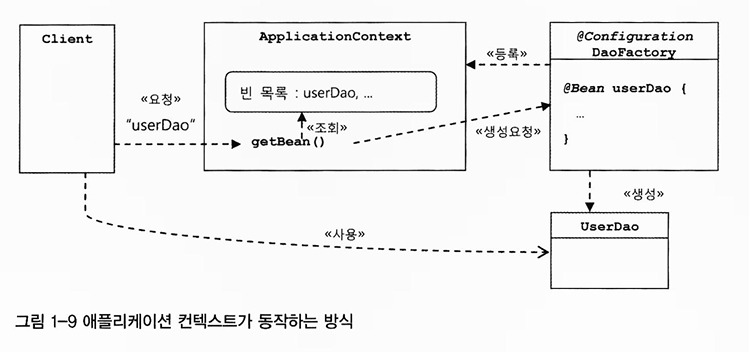
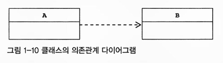
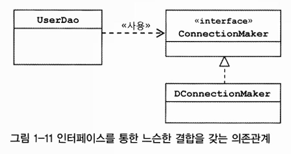
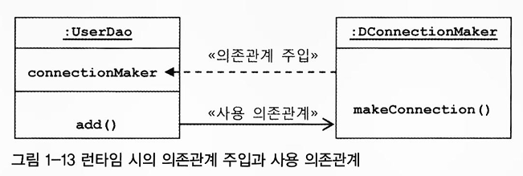
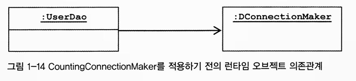
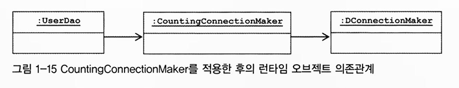
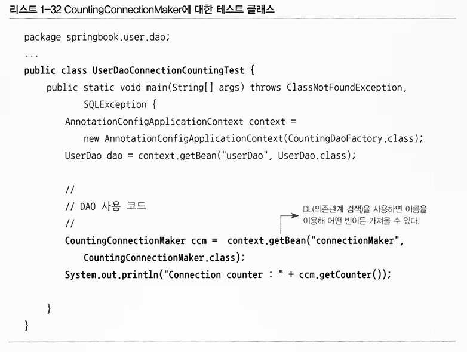

# 챕터 1 - 오브젝트와 의존 관계 (2)

## 1.5 스프링의 IoC

- **스프링 빈**
    - 스프링이 제어권을 가지고 직접 만들고 관계를 부여하는 오브젝트
- **빈 팩토리**
    - 빈 생성 및 관계설정 같은 제어를 담당하는 IoC 오브젝트
- **애플리케이션 컨텍스트**
    - 빈 팩토리의 기능과 더불어 확장된 기능을 가진 IoC 오브젝트
    - 설계도와 비슷한 개념
    - 애플리케이션이 애플리케이션 컨텍스트와 그 설정정보를 따라 만들어짐

### DaoFactory를 사용하는 애플리케이션 컨텍스트

**DaoFactory** → 스프링의 빈 팩토리가 사용할 수 있는 **설정정보**

1. DaoFactory에 **@Configutation 애노테이션** 추가
    1. 오브젝트 설정을 담당하는 클래스라는 것을 알려줌
    2. 애노테이션
        1. 컴파일 단계에서 JVM에게 추가적인 정보를 주는 주석
2. 오브젝트를 만들어주는 메소드에 **@Bean** 추가
    1. userDao(), connectionMaker()

```java
@Configuration
public class DaoFactory{
	@Bean
	public UserDao userDao(){
		// new DConnectionMaker() 반복
		UserDao userDao = new UserDao(connectionMaker());
		return userDao;		
	}

	@Bean
	public ConnectionMaker connectionMaker(){
		return new DConnectionMaker();
	}
}
```

**애플리케이션 컨텍스트 생성**

- AnnotationConfigApplicationContext
    - @Configuration 설정정보를 사용하는 애플리케이션 컨텍스트
    - 생성자 파라미터로 설정정보 클래스를 넣어줌 (DaoFactory)
    - getBean()메소드를 통해 UserDao 오브젝트 가져올 수 있음

```java
public class UserDaoTest {
	public static void main(String[] args) throws ClassNotFoundException, SQLException {
		ApplicationContext context = new AnnotationConfigApplicationContext(DaoFactory.class);
		
		UserDao userDao = context.getBean("userDao", UserDao.class);		

	}
}
```

✅ **getBean()**

---

**getBean(”userDao”, UserDao.class);**

**”userDao”**
- ApplicationContext에 등록된 **빈의 이름**
- **@Bean 애노테이션을 붙힌 메소드 이름

**UserDao.class**
- getBean()은 기본적으로 Object 타입을 리턴
- UserDao.class처럼 명시해주면 **명시해준 클래스의 타입으로 캐스팅되어 리턴**


## 1.5.2 애플리케이션 컨텍스트의 동작방식

**오브젝트 팩토리**

- DAO 오브젝트 생성
- DB 생성 오브젝트와 관계 설정
- 위 2가지의 제한적인 역할

**애플리케이션 컨텍스트**

- 명칭
    - IoC 컨테이너 - 보통 빈 팩토리를 일컬음
    - 스프링 컨테이너
    - 빈 팩토리
- ApplicationContext 인터페이스 구현
- BeanFactory 상속
- **IoC를 적용해서 관리할 모든 오브젝트에 대한 생성과 관계설정 담당**
- DaoFactory와 달리 직접 오브젝트를 생성하고 관계를 맺는 코드는 없음
- **설정정보를 통해 빈 생성및 관계설정을** **얻음**
- **범용적이고 유연한 방법으로 IoC 기능을 확장하기 위함**



>💡 **애플리케이션 컨텍스트**는 DaoFactory 클래스를 설정정보로 등록해두고 **@Bean이 붙은 메소드의 이름을 가져와 빈 목록을 만들어둔다.** <br><br>
클라이언트가 **getBean() 메소드를 호출**하면 자신의 빈 목록에 요청 이름이 있는지 찾고, 있다면 **빈을 생성하는 메소드를 호출**해서 오브젝트를 생성시킨 후 반환

**애플리케이션 컨텍스트의 장점**
---

1. 클라이언트는 **구체적인 팩토리 클래스를 알 필요가 없음**
    1. 빈 이름과 타입만 알면 됨
2. 애플리케이션 컨텍스트는 종합 IoC 서비스를 제공
    1. 오브젝트 생성과 관계설정만 하지 않음
    2. 오브젝트 생성 방식, 시점, 전략 다르게 가져갈 수 있음
    3. 자동생성, 오브젝트 후처리, 정보 조합, 설정방식 다변화, 인터셉팅 등 오브젝트 효과적 활용 기능 제공
    4. 빈이 사용할 수 있는 기반기술 서비스, 외부 시스템과의 연동 제공
3. 애플리케이션 컨텍스트는 빈을 검색하는 다양한 방법 제공
    1. 빈의 이름을 통해 빈을 찾음
    2. 타입만으로 빈 검색 가능

## 1.5.3 스프링 IoC 용어 정리

**빈 (Bean)**

- 스프링이 IoC방식으로 관리하는 오브젝트
- IoC 컨테이너에 의해 생성되고 관리되는 오브젝트

>❗ **스프링을 사용하는 애플리케이션에서 만들어지는 모든 오브젝트가 다 빈은 아님!** <br>
**스프링이 직접 그 생성과 제어를 담당하는 오브젝트만 빈이라 부름**


**빈 팩토리 (Bean Factory)**

- 스프링 IoC를 담당하는 핵심 컨테이너
- 빈 등록, 생성, 조회, 반환 등의 관리 기능 담당
- 보통 이를 확장한 **애플리케이션 컨텍스트** 사용
- BeanFactory 인터페이스 구현
    - getBean() 메소드 정의

**애플리케이션 컨텍스트 (Application Context)**

- 빈 팩토리를 확장한 IoC 컨테이너
- BeanFactory 상속

**설정정보 / 설정 메타정보 (Configuration Metadata)**

- IoC 컨테이너가 사용하는 메타정보
- 보통 IoC 컨테이너에 의해 관리되는 오브젝트를 생성하고 구성할 때 사용
- 애플리케이션의 형상정보 라고도 부름
- 애플리케이션 전체 그림이 그려진 청사진(blueprint)라고도 함

**컨테이너 or IoC 컨테이너 (IoC Container)**

- IoC 방식으로 빈을 관리하는 오브젝트
    - 빈 팩토리 or 애플리케이션 컨텍스트
- **컨테이너 (스프링 컨테이너)**
    - 주로 **애플리케이션 컨텍스트**를 가리킴
- **IoC 컨테이너**
    - 주로 IoC기능에 관점을 둔 **빈 팩토리**를 가리킴
- 애플리케이션 컨텍스트 오브젝트는 아하의 애플리케이션에서 보통 여러 개가 만들어져 사용됨
    - 이를 통틀어 스프링 컨테이너라 부를 수 있음

**스프링 프레임워크**

- 스프링이 제공하는 모든 기능을 통틀어 말할 때 주로 사용

## 1.6 싱글톤 레지스트리와 오브젝트 스코프

💡 **오브젝트의 동일성과 동등성**

**동일성 ( == )**
- 두 개의 오브젝트가 완전히 동일한 오브젝트 (주소가 같음)

**동등성 ( equals )**
- 두 개의 오브젝트가 동일한 정보를 담고있는 오브젝트
****

**DaoFactory의 userDao()를 여러번 호출했을 때 동일한 오브젝트일까?**

- 동일한 오브젝트가 아님
- new를 호출할 때 마다 하고있어 새로운 오브젝트가 계속 메모리에 할당되고있기 때문

**애플리케이션 컨텍스트의 getBean()을 여러번 호출했을 때는 동일한 오브젝트일까?**

- 동일한 오브젝트임!
- 싱글톤 패턴을 사용하기 때문

### 1.6.1 싱글톤 레지스트리로서의 애플리케이션 컨텍스트

**애플리케이션 컨텍스트**는 IoC 컨테이너이자 **싱글톤 레지스트리** 이다.

>💡 **싱글톤 레지스트리**
<br>싱글톤을 저장하고 관리하는 오브젝트
스프링은 기본적으로 별다른 설정을 하지 않으면 내부에서 생성하는 빈 오브젝트를 모두 싱글톤으로 만든다. 이러한 기능을 제공하는 오브젝트를 싱글톤 레지스트리라고 한다.

**서버 애플리케이션과 싱글톤**

---

>💡 **스프링이 싱글톤으로 빈을 만드는 이유**<br>
스프링이 주로 적용되는 대상이 자바 엔터프라이즈 기술을 사용하는 **서버환경**이기 때문<br><br>
스프링 초기 설계 서버환경은 높은 성능이 요구되는 환경
즉, 클라이언트로부터 요청이 많은 환경!!<br><br>
만약 요청할 때마다 로직 담당 오브젝트를 새로 만들어서 사용한다면 서버에 오브젝트가 기하 급수적으로 생성되어 서버에 부하가 걸림<br><br>
엔터프라이즈 분야에서는 **서비스 오브젝트**라는 개념을 사용<br><br>
서블릿은 가장 기본이 되는 서비스 오브젝트
서블릿 클래스당 하나의 오브젝트만 만들고 사용자의 요청을 담당하는 여러 스레드에서 하나의 오브젝트를 공유해 동시에 사용

>💡 **싱글톤 패턴**<br>
애플리케이션 내에서 어떤 클래스의 인스턴스의 개수를 제한하는 패턴 (보통 1개)

**싱글톤 패턴의 한계**

---

- 싱글톤 패턴 구현 방법
    1. 생성자 private
    2. 싱글톤 오브젝트를 저장하는 static 필드 정의
    3. getInstance()라는 스태틱 팩토리 메소드 정의
        1. 메소드 최초 호출 시점에 한번만 오브젝트 만들어지게 함

```java
public class UserDao {
	private static UserDao INSTANCE;

	private UserDao(ConnectionMaker connectionMaker) {
		this.connectionMaker = connectionMaker;
	}

	public static synchronized UserDao getInstance() {
		if (INSTANCE == null) INSTANCE = new UserDao(???);
		return INSTANCE;
	}

	...

}
```

- **싱글톤 패턴의 문제점**
    1. private 생성자를 갖고 있기 때문에 상속할 수 없다.
    2. 테스트하기 힘들다
        1. 초기화 과정에서 생성자를 통해 사용할 오브젝트를 동적으로 주입하기 힘들기에 필요 오브젝트를 직접 만들어 사용할 수 밖에 없음
    3. 서버환경에서는 싱글톤이 하나만 만들어지는 것을 보장하지 못한다.
        1. 클래스 로더 구성에 다라 하나 이상의 오브젝트 생성 가능
        2. 여러 JVM에 분산돼서 설치되는 경우도 독립적으로 오브젝트가 생성되어 버림
    4. 전역 상태를 만들 수 있기 때문에 바람직하지 못함
        1. 스태틱 메소드를 통해 언제든지 싱글톤 인스턴스에 접근할 수 있기에 전역 상태로 사용되기 쉽다.

**싱글톤 레지스트리**

---

스프링은 위와 같은 자바의 싱글톤 패턴 구현 방식의 문제점 때문에 **직접 싱글톤 형태의 오브젝트를 만들고 관리하는 기능을 제공.** 이를 **싱글톤 레지스트리**라 부름!

스프링 컨테이너는 싱글톤을 생성하고, 관리하고, 공급하는 싱글톤 관리 컨테이너

장점

- 평범한 자바 클래스를 싱글톤으로 활용하게 해줌
    - static 메소드, private 생성자 사용X
- IoC 컨테이너를 통해 싱글톤 방식으로 관리 가능
    - 오브젝트 생성 권한이 제어권을 가진 컨테이너에 있기 때문

>💡 스프링은 IoC 컨테이너일 뿐만 아니라 싱글톤을 만들고 관리해주는 싱글톤 레지스트리!

### 1.6.2 싱글톤과 오브젝트의 상태

싱글톤이 멀티스레스 환경에서 사용되려면 상태정보를 내부에 갖고 있지 않은 무상태 방식으로 만들어져야함

- 스레드들이 동시에 싱글톤 오브젝트의 인스턴스 변수를 수정하는 것이 매우 위험하기 때문

인스턴스 변수 사용하는 UserDao

```java
public class UserDao{
	private ConnectionMaker connectionMaker; // 초기 설정 후 바뀌지 않음
	private Connection c; // 매번 새로운 값으로 바뀌는 정보가 저장 (위험!)
	private User user; // 매번 새로운 값으로 바뀌는 정보가 저장 (위험!)

	public Uesr get(String id) throws ClassNotFoundException, SQLException {
		this.c = connectionMaker.makeConnection();
		...
		this.user = new User();
		...
		return this.user;
	}

}
```

- 위와 같은 상황이면 새로운 값으로 바뀌는 정보를 멤버 변수로 가지는 건 위험!

### 1.6.3 스프링 빈의 스코프

>💡 **빈 스코프**<br>
빈이 생성되고, 존재하고, 적용되는 범위


싱글톤 스코프

- 오브젝트 첫 호출 시에만 오브젝트 생성
- 스프링 빈의 기본 스코프

프로토타입 스코프

- 컨테이너에 빈 요청할 때마다 새로운 오브젝트 생성

요청 스코프

- HTTP 요청이 생길 때 마다 새로운 오브젝트 생성

## 1.7 의존관계 주입(DI)

의존관계 주입 (Dependency Injection)

- 스프링 IoC 기능의 대표적인 동작 원리

>💡 의존관계 주입, 의존성 주입, 의존 오브젝트 주입<br>
Dependency Injection은 흔히 의존성 주입이라 부름
오브젝트 레퍼런스를 외부로부터 주입받아 여타 오브젝트와 동적으로 의존관계가 만들어짐

### 1.7.2 런타임 의존관계 설정

**의존관계**



- 어떤 클래스가 변하면 다른 클래스에 영향을 미칠 때 이 두 클래스는 의존관계라고 함
- B가 변하면 A에 영향을 줌
- 예시
    - A가 B의 메소드를 호출해서 사용

**UserDao의 의존관계**



**UserDao는 ConnectionMaker 인터페이스에만 의존**

결합도가 낮다고 할 수 있음

모델이나 코드에서 클래스와 인터페이스를 통해 드러나는 의존관계 외에 **런타임 시 의존관계도 존재**

**의존 오브젝트**

- 오브젝트가 만들어지고 나서 런타임 시에 의존관계를 맺는 대상, 즉 실제 사용대상인 오브젝트
- 위에서는 **DConnectionMaker**

>💡 **의존관계 주입**<br>
구체적인 의존 오브젝트와 그것을 사용할 클라이언트 오브젝트를 런타임 시에 연결해주는 작업<br><br>
아래 세 가지 조건 충족<br>
1. 클래스 모델이나 코드에는 런타임 시점의 의존관계가 드러나지 않음 → 인터페이스에만 의존<br>
2. 런타임 시점의 의존관계는 컨테이너나 팩토리 같은 제 3의 존재가 결정<br>
3. 의존관계는 사용할 오브젝트에 대한 레퍼런스를 외부에서 제공해줌

**의존관계 주입의 핵심**

- **설계 시점에 알지 못했던 두 오브젝트의 관계**를 맺도록 도와주는 제 3자가 있다는 것
- 제 3자
    - 애플리케이션 컨텍스트
    - 빈 팩토리
    - IoC 컨테이너

**UserDao의 의존관계 주입**

```jsx
// 의존관계 주입 전
public class UserDao{
	private ConnectionMaker connectionMaker;

	public UserDao(){
		this.connectionMaker = new DConnectionMaker;
	}

}

// 의존관계 주입 후
public class UserDao{
	private ConnectionMaker connectionMaker;

	public UserDao(ConnectionMaker connectionMaker){
		this.connectionMaker = connectionMaker;
	}
}
```



### 1.7.3 의존관계 검색과 주입

>💡 **의존관계 검색 (Dependency Lookup - DL)**<br>
자신이 필요로 하는 의존 오브젝트를 능동적으로 찾음
자신이 어떤 클래스의 오브젝트를 이요할지 결정은 안함. 런타임 시 의존관계를 맺을 오브젝트를 결정하는 것과 오브젝트 생성 작업은 외부 컨테이너에게 IoC로 맡김

하지만 **이를 가져올 때는** 메소드나 생성자를 통한 주입 대신 **스스로 컨테이너에게 요청하는 방법 사용**

</aside>

```java
// DaoFactory를 이용하는 생성자
public UserDao() {
	DaoFactory daoFactory = new DaoFactory();
	this.connectionMaker = daoFactory.connectionMaker();
}

// 의존관계 검색을 이용하는 생성자
public UserDao() {
	AnnotationConfigApplicationContext context = new AnnotationConfigApplicationContext(DaoFactory.class);
	// 스프링 API이 나타남 (getBean)
	this.connectionMaker = context.getBean("connectionMaker",ConnectionMaker.class);
}
```

의존관계 검색 방법은 코드 안에 스프링 API가 나타남

성격이 다른 오브젝트에 의존하게 되는 것 → 바람직하지 않음

UserDao에서 스프링이나 오브젝트 팩토리를 만들고 API를 이용하는 코드가 섞여있는 것은 어색함

대개 의존관계 주입 방식 사용하는 편이 나음

의존관계 검색 방식 사용처

- 테스트 코드
- 자신이 스프링 빈일 필요가 없을 때

>💡 **DI 받는다**<br>외부에서 파라미터로 오브젝트를 넘겨줬다고 해서 DI가 아님<br>파라미터 타입이 특정 클래스가 아니고 인터페이스 타입이어야 함

### 1.7.4 의존관계 주입의 응용

**DI 기술 장점**

1. 결합도가 낮은 코드
    1. 다른 책임을 가진 사용 의존관계에 있는 대상이 바뀌거나 변경되더라도 영향을 받지 않음
    2. 구체적인 클래스 오브젝트에 관심이 없음
    3. 변경을 통한 다양한 확장 방법에 자유로움

**기능 구현의 교환**

로컬 DB로 개발하다 운영서버에 배치에서 사용하는 상황

- DI 방식 적용하지 않은 경우
    - 로컬 DB 연결 기능이 있는 LocalDBConnectionMaker라는 클래스 생성
    - 모든 DAO 코드에 new LocalDBConnectinoMaker()가 존재
    - 하지만 실제 운영서버에는 그 서버의 DB 연결 클래스 사용해야함
    - 이를 ProductionDBConnectionMaker라는 클래스로 변경해야함
    - 만약 DAO가 100개라면 최소 100군데 수정해야함
- DI 방식 적용한 경우
    - 모든 DAO는 생성 시점에 ConnectionMaker 타입 오브젝트를 컨테이너로부터 제공받음
    - 구체 클래스 이름은 설정정보에 있음
    - 아래 코드처럼 설정정보만 변경해주면 됨
    
    ```jsx
    @Configuration
    public class DaoFactory{
    	...
    
    	// 개발용 ConnectionMaker 생성 코드
    	// @Bean
    	// public ConnectionMaker connectionMaker(){
    	// 	 return new LocalDBConnectionMaker();
    	// }
    
    	// 운영용 ConnectionMaker 생성 코드
    	@Bean
    	public ConnectionMaker connectionMaker(){
    		return new ProductionDBConnectionMaker();
    	}
    }
    ```
    

**부가기능 추가**

DAO가 DB를 얼마나 많이 연결해서 사용하는지 파악하는 경우

- DAO와 DB 커넥션을 만드는 오브젝트 사이에 연결횟수를 카운팅하는 오브젝트를 하나 더 추가

```jsx
public class CountingConnectionMaker implements ConnectionMaker{
	int counter = 0;
	private ConnectionMaker realConnectionMaker;

	public CountingConnectionMaker(ConnectionMaker realConnectionMaker){
		this.realConnectionMaker = realConnectionMaker;
	}

	public Connection makeConnection() throws ClassNotFoundException, SQLException {
		this.counter++;

		return realConnectionMaker.makeConnection();
	}

	public int getCounter(){
		return this.counter;
	}
}
```





```jsx
@Configuration
public class CountingDaoFactory{
	@Bean
	public UserDao userDao(){
		return new UserDao(connectionMaker());
	}

	@Bean
	public ConnectionMaker connectionMaker(){
		return new CountingConnectionMaker(realConnectionMaker());
	}

	@Bean
	public ConnectionMaker realConnectionMaker(){
		return new DConnectionMaker();
	}

}
```



의존성 주입을 통해 새로운 클래스를 만드는 것만으로 부가 기능을 추가할 수 있게 되었다!

### 1.7.5 메소드를 이용한 의존관계 주입

지금까지는 생성자를 통해 의존관계를 주입해왔음

이제는 일반 메소드를 통해 의존관계 주입을 해볼것임

- 이게 더 자주 사용됨!

**일반 메소드를 이용한 주입**

**수정자 메소드를 이용한 주입**

- setter 사용
- 가장 많이 사용
- 메소드 이름 잘 결정해야함
    - ConnectionMaker 인터페이스 타입 오브젝트 DI라면
    - setConnectionMaker()

```jsx
public class UserDao{
	private ConnectionMaker connectionMaker;

	public void setConnectionMaker(ConnectionMaker connectionMaker){
		this.connectionMaker = connectionMaker;
	}
}
```

```jsx
@Configuration
public class DaoFactory{
	@Bean
	public UserDao userDao(){
		UserDao userDao = new UserDao();
		userDao.setConnectionMaker(connectionMaker());
		return userDao;
	}

	@Bean
	public ConnectionMaker connectionMaker(){
		return new DConnectionMaker();
	}
}
```

## 1.8 XML을 이용한 설정

### 1.8.1 XML 설정

<beans>를 루트 엘리먼트로 사용

<beans> 안에 여러 개의 <bean> 정의

<beans> → @Configuration

<bean> → @Bean

빈의 정보

- 빈의 이름
    - @Bean 메소드 이름
    - ex - userDao
- 빈의 클래스
    - 어떤 클래스를 이용해서 빈 오브젝트를 만들지
    - ex - UserDao
    - 리턴 타입을 사용하지 않도록
        - 실제 사용할 클래스를 지정하는 것이기 때문
        - 만약 UserDao가 리턴 타입인데 UserDao를 상속받는 클래스를 사용하고 싶다면 그 클래스를 지정
- 빈의 의존 오브젝트
    - 빈이 사용하는 실제 오브젝트
    - ex - DConnectionMaker

**connectionMaker() 전환**

|  | 자바 코드 설정정보 | XML 설정정보 |
| --- | --- | --- |
| 빈 설정파일 | @Configuration | <beans> |
| 빈 이름 | @Bean methodName() | <bean id=”methodName” |
| 빈 클래스 | return new BeanClass(); | class = “a.b.c… BeanClass”> |

**connectionMaker() 메소드의 <bean> 태그 전환**

```java
>@Bean ------ --- -------- -- •> [bean
public ConnectionMaker
connectionMakerO { --------------- > id-'connectionMaker"
	return new DConnectionMakerO；-- > class-'springbook.. .DConnectionMaker" />
}
```

**userDao() 전환**

connectionMaker와 관계설정 해야함

<property> 태그를 사용하여 의존 오브젝트와 관계 정의

<property>

- 애트리뷰트
    - name
        - DI에 사용할 수정자 메소드의 프로퍼티 이름
    - ref
        - 주입해줄 오브젝트 빈 이름

```java
// UserDao.java
public void setConnectionMaker(ConnectionMaker connectionMaker) {
	// connectionMaker : name 
	this.connectionMaker = connectionMaker;
}

// DaoFactory.java
@Configuration
public class DaoFactory{
	@Bean
	public UserDao userDao(){
		UserDao userDao = new UserDao();
		// connectionMaker : ref
		userDao.setConnectionMaker(connectionMaker());
		// <property name="connectionMaker" ref="connectionMaker" />
		return userDao;
	}

	@Bean
	public ConnectionMaker connectionMaker(){
		return new DConnectionMaker();
	}
}
```

```java
userDao.setConnectionMaker(connectionMaker());
				------------------------------------
<property name="connectionMaker" ref="connectionMaker" />
```

setConnectionMaker(ConnectionMaker connectionMaker)

→ <property name=”connectionMaker”

setConnectionMaker(connectionMaker()) 

→ ref = “connectionMaker”

**userDao 빈 설정**

```xml
<bean id="UserDao" class="springbook.dao.UserDao">
	<property name="connectionMaker" ref="ConnectionMaker" />
</bean>
```

**XML의 의존관계 주입 정보**

완성된 XML 설정정보

```xml
<beans>
	<bean id="connectionMaker" class="springbook.user.dao.DConnectionMaker" />
	<bean id="userDao" class="springbook.user.dao.UserDao">
		<property name="connectionMaker" ref="connectionMaker" />
	</bean>
</beans>
```

같은 인터페이스 타입의 빈 여러 개 정의한 경우

```xml
<beans>
	<bean id="localDBConnectionMaker" class="...LocalDBConnectionMaker" />
	<bean id="testDBConnectionMaker" class="...TestDBConnectionMaker" />
	<bean id="productionDBConnectionMaker" class="...ProductionDBConnectionMaker" />
	
	<bean id="userDao" class="springbook.user.dao.UserDao">
		<property name="connectionMaker" ref="localDBConnectionMaker" />
	</bean>
</beans>
```

>💡 **DTD와 스키마**
<br><br>
 XML 문서의 구조를 정의하는 방법에는 DTD와 스키마(schema)가 있다. 
<br><br>
스프링의 XML 설정파일은 이 두 가지 방식을 모두 지원한다.
<br><br>
DTD를 사용할 경우에는〈beans〉엘리먼트 앞에 다음과 같은 DTD 선언을 넣어준다. <br><!D0CTYPE beans PUBLIC "-//SPRING//DTD BEAN 2.0//EN"
"[http://www.springframework.org/dtd/spring-beans-2.O.dtd](http://www.springframework.org/dtd/spring-beans-2.O.dtd)">
<br><br>
스프링은 이를 위한 기본 태그인〈beans〉, <bean> 외에도 특별한 목적을 위해 별도의 태그를 사용할 수 있는 방법을 제공한다. 이 태그들은 각각 별개의 스키마 파일에 정의되어 있고 독립적인 네임스페이스를 사용해야만 한다. 따라서 이런 태그를 사용하려면 DTD 대신 네임스페이스가 지원되는 스키마를 사용해야 한다.〈beans〉태그를 기본 네임스페이스로 하는 스키마 선언은 다음과 같다.
<br><br>
<beans xmlns="[http://www.springframework.org/schema/beans](http://www.springframework.org/schema/beans)"
xmlns:xsi="[http://www.w3.org/2001/XMLSchema-instance](http://www.w3.org/2001/XMLSchema-instance)"
xsi:schemaLocation-’[http://www.springframework.org/schema/beans](http://www.springframework.org/schema/beans)[http://www.springframework.org/schema/beans/spring-beans-3.0.xsd”](http://www.springframework.org/schema/beans/spring-beans-3.0.xsd%E2%80%9D)>
<br><br>
특별한 이유가 없다면 DTD보다는 스키마를 사용하는 편이 바람직하다. 선언이 좀 더 길어서 입력하기 힘들게 보일지 모르겠지만 Vol. 1에서 설명할 스프링 IDE의 XML 에디터를 사용하면 스키마 선언을 간단히 만들고 관리할 수 있으니 걱정할 것은 없다.

</aside>

### 1.8.2 XML을 이용하는 애플리케이션 컨텍스트

**GenericXmlApplicationContext** 사용

애플리케이션 컨텍스트가 사용하는 XML 설정파일의 이름은 관례를 따라
applicationContext.xml이라고 만든다

**applicationContext.xml**

```xml
<?xml version="1.0" encoding="UTF-8"?>
<beans xmlns="http：//www.springframework.org/schema/beans"
	xmlns:xsi="http：//www.w3.org/2001/XMLSchema-instance"
	xsi:schemaLocation="http://www.springframework.org/schema/beans
	http://www.springframework.Org/schema/beans/spring-beans-3.0.xsd">
	<bean id="connectionMaker" class="springbook.user.dao.DConnectionMaker" />
	<bean id="userDao" class="springbook.user.dao.UserDao">
		<property name="connectionMaker" ref="connectionMaker" />
	</bean>
</beans>
```

**UserDaoTest.java**

```xml
ApplicationContext context = new GenericXmlApplicationContext(
"applicationContext.xml");
```

**ClassPathXmlApplicationContext** 사용해도 가능

- xml 파일 위치를 class path로하여금 상대적으로 지정 가능

### 1.8.3 DataSource 인터페이스로 변환

자바에서는 DB 커넥션을 가져오는 오브젝트의 기능을 추상화해서 비슷한 용도로 사용할 수 있게 만들어진 DataSource라는 인터페이스가 이미 존재

그리고 이미 DataSource 구현체가 존재, 사용만 하면 됌

**자바 코드 설정 방식**

---

```java
import javax.sql.DataSource;

public class UserDao {
	private DataSource dataSource;
	
	public void setDataSource(DataSource dataSource) {
		this.dataSource = dataSource;
	}

	public void add(User user) throws SQLException {
		Connection c = dataSource.getConnection();
	}
}
```

DataSource 구현체로 **SimpleDriverDataSource**를 사용하여 DI 재구성

```java
@Bean
public DataSource dataSource() {
	SimpleDriverDataSource dataSource = new SimpleDriverDataSource();
	dataSource.setDriverClass(com.mysql.jdbc.Driver.class);
	dataSource.setUrl("jdbc:mysql://localhost/springbook");
	dataSource.setUsername("spring");
	dataSource.setPassword("book");
	return dataSource;
}
```

```java
©Bean
public UserDao userDao() {
	UserDao userDao = new UserDao();
	userDao.setDataSource(dataSource());
	return userDao;
}
```

**XML 설정 방식**

---

### 1.8.4 프로퍼티 값의 주입

**값 주입**

---

텍스트나 단순 오브젝트 등을 수정자 메소드에 넣어주는 것

property 태그에 value 애트리뷰트 추가

```java
<property name="driverClass" value="com.mysql.jdbc.Driver" />
<property name="url" value="jdbc:mysql://localhost/springbook" />
<property name="username" value="spring" />
<property name="password" value="book" />
```

value에 지정한 텍스트 값을 적절한 자바 타입으로 변환해줌

최종 applicationContext.xml

```xml
<?xml version="1.0" encoding="UTF-8"?>
<beans xmlns="http://www.springframework.org/schema/beans"
xmlns:xsi="http://www.w3.org/2001/XMLSchema-instance"
xsi:schemaLocation="http://www.springframework.org/schema/beans
http://www.springframework.org/schema/beans/spring-beans-3.0.xsd">
	<bean id="dataSource"
	class-'org.springframework.jdbc.datasource.SimpleDriverDataSource">
		<property name-'driverClass" value="com.mysql.jdbc,Driver" />
		<property name="url" value="jdbc:mysql://localhost/springbook" />
		<property name="username" value="spring" />
		<property name="password" value="book" />
	</bean>
	<bean id="userDao" class="springbook.user.dao.UserDao">
		<property name="dataSource" ref="dataSource" />
	</bean>
</beans>
```
