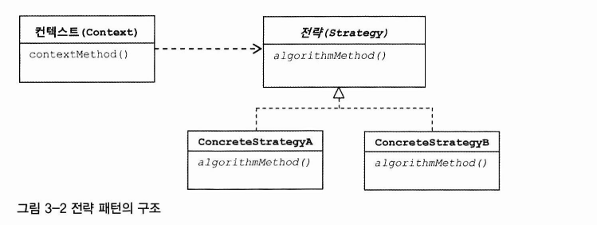

# 4주차 템플릿

개방 폐쇄 원칙

- 변화의 특성이 다른 부분 구분
- 다른 시점에 독립적으로 변경될 수 있는 효율적인 구조 생성

템플릿

- 변화의 성질이 다른 코드 중 변경이 거의 일어나지 않으며 일정한 패턴으로 유지되는 특성을 가진 부분을 자유롭게 변경되는 성질을 가진 부분으로 독립시켜 효과적으로 활용할 수 있도록 하는 방법

## 3.1 다시보는 초난감 DAO

문제점

- 예외상황 처리

### 3.1.1 예외처리 기능을 갖춘 DAO

예외 발생시 사용한 리소스를 반드시 반환해야함

[ deleteAll() ]

```jsx
public void deleteAll() throws SQLException {
	Connection c = dataSource.getConnection();
	PreparedStatement ps = c.prepareStatement("delete from users");
	ps.executeUpdate();
	ps.close();
	c.close();
}
```

Connection, PreparedStatement라는 공유 리소스 사용

```jsx
	PreparedStatement ps = c.prepareStatement("delete from users");
	ps.executeUpdate();
```

위 코드 실행 시 에러가 발생하면 close를 하지 않아 리소스 반환이 되지 않는 문제가 발생

JDBC 코드에서는 어떤 상황에서도 가져온 리소스를 반환하도록 try / catch / finally 구문 사용 권장

> ✨ **리소스 반환과 close()**
>
> Connection이나 PreparedStatement에는 close() 메소드가 있다. 이름으로 보면 열린 것을 닫는다는 의미다. 단순하게 생각하면 만들어진 걸 종료하는 것이라고 볼 수도 있지만 보통 리소스를 반환한다는 의미로 이해하는 것이 좋다. Connection과 PreparedStatement는 보통 풀(pool)방식으로 운영된다. 미리 정해진 풀 안에 제한된 수의 리소스(Connection, Statement)를 만들어두고 필요할 때 이를 할당하고, 반환하면 다시 풀에 넣는 방식으로 운영된다. 요청이 매우 많은 서버환경에서는 매번 새로운 리소스를 생성하는 대신 풀에 미리 만들어둔 리소스를 돌려가며 사용하는 편이 훨씬 유리하다. 대신, 사용한 리소스는 빠르게 반환해야 한다. 그렇지 않으면 풀에 있는 리소스가 고갈되고 결국 문제가 발생한다. close() 메소드는 사용한 리소스를 풀로 다시 돌려주는 역할을 한다

```jsx
public void deleteAll() throws SQLException {
	Connection c = null;
	PreparedStatement ps = null;
	try {
		c = dataSource.getConnection();
		ps = c.prepareStatement("delete from users");
		ps.executeUpdate();
	} catch (SQLException e) { // 예외가 발생했을 때 부가적인 작업을 해줄 수 있도록 catch 블록을 둔다.
		throw e;                 // 아직은 예외를 다시 메소드 밖으로 던지는 것밖에 없다
	} finally { // finallyoi므로 try 블록에서 예외가 발생했을 때나 안 했을 때나 모두 실행된다.
		if(ps != null) {
			try {
				ps.close(); // ps.close() 메소드에서도 SQLException이 발생할 수 있기 때문
			} catch (SQLException e) {
			}
		}
		if (c != null) {
			try {
				c.close(); // Connection 반환
			} catch (SQLException e) {
			}
		}
	}
}
```

**JDBC 조회 기능의 예외처리**

---

조회를 위해선 Connection, PreparedStatement 외에 ResultSet이라는 공유 리소스 추가

```jsx
public int getCount() throws SQLException {
	Connection c = null;
	PreparedStatement ps = null;
	ResultSet rs = null;
	try {
		c = dataSource.getConnection();
		ps = c.prepareStatement("select count(*) from users");
		rs = ps.executeQuery();
		rs.next();
		return rs.getlnt(1);
	} catch (SQLException e) {
		throw e;
	} finally {
		if (rs != null) {
			try {
				rs.close(); // 만들어진 ResultSet을 닫아주는 기능. close()는 만들어진 순서의 반대로 하는 것이 원칙이다.
			} catch (SQLException e) {
			}
		}
		if (ps != null) {
			try {
				ps.close();
			} catch (SQLException e) {
			}
		}
		if (c != null) {
			try {
				c.close();
			} catch (SQLException e) {
			}
		}
	}
}
```

## 3.2 변하는 것과 변하지 않는 것

### 3.2.1 JDBC try/catch/finally 코드의 문제점

try/catch/finally 블록이 모든 메소드마다 반복

### 3.2.2 분리와 재사용을 위한 디자인 패턴 적용

[ 개선할 delecteAll() 메소드 ]

```jsx
public void deleteAll() throws SQLException {
	Connection c = null;
	PreparedStatement ps = null;
	try {
		c = dataSource.getConnection();

		ps = c.prepareStatement("delete from users"); // 변하는 부분

		ps.executeUpdate();
	} catch (SQLException e) {
		throw e;
	} finally {
		if(ps != null) {
			try {
				ps.close();
			} catch (SQLException e) {
			}
		}
		if (c != null) {
			try {
				c.close();
			} catch (SQLException e) {
			}
		}
	}
}
```

**메소드 추출**

---

```jsx
public void deleteAll() throws SQLException {
	c = dataSource.getConnection();
	try {

	ps = makeStatement(c); // 변하는 부분 메소드 추출

	ps.executeUpdate();
	} catch (SQLException e)
	}
}
private PreparedStatement makeStatement(Connection c) throws SQLException {
	PreparedStatement ps;
	ps = c.prepareStatement("delete from users");
	return ps;
}
```

위 분리는 잘못되었음

분리시키고 남은 메소드(deleteAll의 남은 부분)

- 재사용이 필요한 부분

분리된 메소드(makeStatement)

- DAO 로직마다 새롭게 만들어서 확장돼야 하는 부분

분리된 메소드를 재사용하는데 사용해야 하는데 그렇지 않음

**템플릿 메소드 패턴의 적용**

---

변하지 않는 부분 → 슈퍼클래스

변하는 부분 → 추상 메소드, 하위 클래스에서 오버라이드

[ makeStatement()를 추상화]

```jsx
abstract protected PreparedStatement makeStatement(Connection c) throws SQLException;；
```

[ makeStatement()를 구현한 UserDao 서브클래스 ]

```jsx
public class UserDaoDeleteAll extends UserDao {
	protected PreparedStatement makeStatement(Connection c) throws SQLException {
		PreparedStatement ps = c.prepareStatement("delete from users");
		return ps；
	}
}
```

템플릿 메소드 패턴으로의 접근은 제한이 많음

- DAO 로직마다 상속을 통해 새로운 클래스 생성해야함
- 확장구조가 클래스 설계 시점에 고정

**전략 패턴 적용**

---

1. 오브젝트를 둘로 분리
2. 인터페이스를 통해서만 의존



contextMethod : deleteAll

- 변하지 않는 부분

deleteAll의 컨텍스트

1. DB 커넥션 가져오기
2. PreparedStatement를 만들어줄 **외부 기능 호출**하기
   1. 전략 패턴의 **Strategy**
3. 전달받은 PreparedStatement 실행하기
4. 예외 발생시 예외 던지기
5. 공유 리소스 반환하기

[ StatementStrategy 인터페이스 ]

```jsx
public interface Statementstrategy {
	PreparedStatement makePreparedStatement(Connection c) throws SQLException;
}
```

[ 인터페이스 상속하여 deleteAll() 메소드 구현한 전략 클래스 ]

```jsx
public class DeleteAllStatement implements Statementstrategy {
	public PreparedStatement makePreparedStatement(Connection c) throws SQLException {
		PreparedStatement ps = c.prepareStatement("delete from users");
		return ps;
	}
}
```

[ 전략 패턴 적용한 deleteAll() 메소드 ]

```jsx
public void deleteAll() throws SQLException {
	try {
		c = dataSource.getConnection();
		Statementstrategy strategy = new DeleteAllStatement();
		ps = strategy.makePreparedStatement(c);
		ps.executeUpdate();
	} catch (SQLException e) {
	}
}
```

위 처럼 하면 컨텍스트가 이미 구체적인 전략 클래스를 알고있음

이는 전략 패턴도, OCP에도 잘 들어맞지 않음

컨텍스트가 필요로 하는 전략의 **특정 구현 클래스 오브젝트**를 **클라이언트가 만들어서 제공**하도록!

**DI**란 전략 패턴의 장점을 일반적으로 활용할 수 있도록 만든 구조

**해결**

1. 컨텍스트에 해당하는 부분은 별도의 메소드로 독립

   1. StatementStrategy를 메소드 파라미터로 지정

   ```jsx
   public void jdbcContextWithStatementStrategy(StatementStrategy stmt) throws SQLException {
   	Connection c = null;
   	PreparedStatement ps = null;
   	try {
   		c = dataSource.getConnection();
   		ps = stmt.makePreparedStatement(c);
   		ps.executeUpdate();
   	} catch (SQLException e) {
   		throw e;
   	} finally {
   		if (ps != null) { try { ps.close(); } catch (SQLException e) {}}
   		if (c != null) { try {c.close(); } catch (SQLException e) {}}
   	}
   }
   ```

2. 클라이언트는 컨텍스트가 사용할 Statementstrategy 구현체를 컨텍스트 메소드를 호출할 때 넘겨줌

   ```jsx
   public void deleteAll() throws SQLException {
   	StatementStrategy st = new DeleteAllStatementO; // 선정한 전략 클래스의 오브젝트 생성
   	jdbcContextWithStatementStrategy(st); //  컨텍스트 호출. 전략 오브젝트 전달
   }
   ```

> ✨ **마이크로 DI**
>
> 의존관계 주입(DI)은 다양한 형태로 적용할 수 있다. 이의 가장 중요한 개념은 제3자의 도움을통해 두 오브젝트 사이의 유연한 관계가 설정되도록 만든다는 것이다. 이 개념만 따른다면 미를 이루는 오브젝트와 구성요소의 구조나 관계는 다양하게 만들 수 있다.
>
> 일반적으로 이는 의존관계에 있는 두 개의 오브젝트와 이 관계를 다이내믹하게 설정해주는 오브젝트 팩토리(DI 컨테이너), 그리고 이를 사용하는 클라이언트라는 4개의 오브젝트 사이에서 일어난다. 하지만 때로는 원시적인 전략 패턴 구조를 따라 클라이언트가 오브젝트 팩토리의 책임을 함께 지고 있을 수도 있다. 또는 클라이언트와 전략(의존 오브젝트)이 결합될 수도 있다. 심지어는 클라이언트와 DI 관계에 있는 두 개의 오브젝트가 모두 하나의 클래스 안에 담길 수도
> 있다.
>
> 이런 경우에는 이가 매우 작은 단위의 코드와 메소드 사이에서 일어나기도 한다. 얼핏 보면 DI같아 보이지 않지만, 세밀하게 관찰해보면 작은 단위지만 엄연히 이가 이뤄지고 있음을 알 수있다. 이렇게 이의 장점을 단순화해서 loC 컨테이너의 도움 없이 코드 내에서 적용한 경우를 마이크로 DI라고도 한다. 또는 코드에 의한 이라는 의미로 수동 이라고 부를 수도 있다.

## 3.3 JDBC 전략 패턴의 최적화

### 3.3.1 전략 클래스의 추가 정보

add()에서는 user라는 부가정보 필요

생성자를 통해 user 오브젝트 받아옴

```jsx
public class AddStatement implements Statementstrategy {
	User user;
	public AddStatement(User user) {
		this.user = user;
	}
	public PreparedStatement makePreparedStatement(Connection c) {
		ps.setString(1, user.getld());
		ps.setString(2, user.getName());
		ps.setString(3z user.getPassword());
	}
}
```

[ user 정보를 AddStatetment에 전달해주는 add() 메소드 ]

```jsx
public void add(User user) throws SQLException {
	StatementStrategy st = new AddStatement(user);
	jdbcContextWithStatementStrategy(st);
}
```

### 3.3.2 전략과 클라이언트의 동거

개선할 부분

1. DAO 메소드마다 새로운 StatementStrategy 구현 클래스 만들어야함
2. StatementStrategy에 전달할 부가 정보가 있는 경우 인스턴스 변수를 번거롭게 만들어야 함

**로컬 클래스**

---

클래스 파일이 많아지는 문제 해결을 위해 특정 클래스에 종속적인 클래스를 내부(로컬) 클래스로 만드는 방법이 존재

[ add()메소드 내 로컬 클래스로 이전한 AddStatement ]

```jsx
public void add(User user) throws SQLException {
	// add 메소드 내부에 선언된 로컬 클래스
	class AddStatement implements Statementstrategy {
		User user;

		public AddStatement(User user) {
			this.user = user；
		}

		public PreparedStatement makePreparedStatement(Connection c) throws SQLException {
			PreparedStatement ps = c.prepareStatement("insert into users(id, name, password) values(?,?,?)");
			ps.setString(1, user.getld());
			ps.setString(2, user.getName());
			ps.setstring(3, user.getPassword());
			return ps;
		}
	}

	Statementstrategy st = new AddStatement(user);
	jdbcContextWithStatementStrategy(st);
}
```

> ✨ **중첩 클래스의 종류**
>
> 다른 클래스 내부에 정의되는 클래스를 중첩 클래스(nested class)라고 한다. 중첩 클래스는 독립적으로 오브젝트로 만들어질 수 있는 스태틱 클래스(static class)와 자신이 정의된 클래스의오브젝트 안에서만 만들어질 수 있는 내부 클래스(inner class)로 구분된다.
>
> 내부 클래스는 다시 범위(scope)에 따라 세 가지로 구분된다. 멤버 필드처럼 오브젝트 레벨에정의되는 멤버 내부 클래스(member inner class)와 메소드 레벨에 정의되는 로컬 클래스(local class), 그리고 이름을 갖지 않는 익명 내부 클래스(anonymous inner class)다. 익명 내부 클래스의 범위는 선언된 위치에 따라서 다르다.

로컬 클래스 장점

- 자신이 선언된 곳의 정보에 접근할 수 있음
- 인스턴스 변수를 선언하지 않아도 User 정보 사용 가능

[ add() 메소드의 로컬 변수를 직접 사용하도록 수정한 AddStatement ]

```jsx
public void add(final User user) throws SQLException {
	class AddStatement implements Statementstrategy {
		public PreparedStatement makePreparedStatement(Connection c) throws SQLException {
			PreparedStatement ps = c.prepareStatement("insert into users(id, name, password) values(?,?,?)");

			// 내부 클래스이므로 외부 메소드의 로컬 변수에 접근 가능
			ps.setString(1, user.getld());
			ps.setString(2, user.getName());
			ps.setstring(3, user.getPassword());
			return ps;
		}
	}

	Statementstrategy st = new AddStatement();
	jdbcContextWithStatementStrategy(st);
}
```

**익명 내부 클래스**

---

AddStatement 는 add() 에서만 사용할 용도로 만들어짐

즉, 더 간결하게 클래스 이름 제거 가능 - **익명 클래스!**

> ✨ **익명 내부 클래스**
>
> 익명 내부 클래스(anonymous inner class)는 이름을 갖지 않는 클래스다. 클래스 선언과 오브젝트 생성이 결합된 형태로 만들어지며, 상속할 클래스나 구현할 인터페이스를 생성자 대신 사용해서 다음과 같은 형태로 만들어 사용한다. 클래스를 재사용할 필요가 없고, 구현한 인터페이스 타입으로만 사용할 경우에 유용하다.
>
> new 인터페이스이름() { 클래스 본문 }；

[ AddStatement를 익명 내부 클래스로 전환 ]

```jsx
public void add(final User user) throws SQLException {
	Statementstrategy st = new Statementstrategy(){
		public PreparedStatement makePreparedStatement(Connection c) throws SQLException {
			PreparedStatement ps = c.prepareStatement("insert into users(id, name, password) values(?,?,?)");

			// 내부 클래스이므로 외부 메소드의 로컬 변수에 접근 가능
			ps.setString(1, user.getld());
			ps.setString(2, user.getName());
			ps.setstring(3, user.getPassword());
			return ps;
		}
	};
	jdbcContextWithStatementStrategy(st);
}
```

익명 내부 클래스 오브젝트는 단 한번 사용되니 바로 매개변수로 넣어줌

[ 메소드 파라미터로 이전한 익명 내부 클래스 ]

```jsx
public void add(final User user) throws SQLException {
	jdbcContextWithStatementStrategy(
		new Statementstrategy(){
			public PreparedStatement makePreparedStatement(Connection c) throws SQLException {
				PreparedStatement ps = c.prepareStatement("insert into users(id, name, password) values(?,?,?)");

				// 내부 클래스이므로 외부 메소드의 로컬 변수에 접근 가능
				ps.setString(1, user.getld());
				ps.setString(2, user.getName());
				ps.setstring(3, user.getPassword());
				return ps;
			}
		}
	);
}
```

[ 익명 내부 클래스를 적용한 deleteAll() 메소드 ]

```jsx
public void deleteAll() throws SQLException {
	jdbcContextWithStatementStrategy(
		new Statementstrategy(){
			public PreparedStatement makePreparedStatement(Connection c) throws SQLException {
				return c.prepareStatement("delete from users");
		}
	);
}
```

## 3.4 컨텍스트와 DI

### 3.4.1 JdbcContext의 분리

클라이언트

- UserDao의 메소드
  - 컨텍스트가 사용할 전략 오브젝트를 생성하고 넣어주기 때문

전략

- 익명 내부 클래스로 만들어진 오브젝트

컨텍스트

- jdbcContextWithStatementStrategy 메소드

JDBC 컨텍스트인 jdbcContextWithStatementStrategy 메소드는 다른 DAO에서도 사용 가능

- UserDao 클래스 밖으로 독립

**클래스 분리**

---

분리 클래스 이름 : **JdbcContext**

jdbcContextWithStatementStrategy를 workWithStatementStrategy라는 이름으로 바꿈

이렇게 하면 JdbcContext에서 DataSource가 필요

[ JDBC 작업 흐름을 분리해서 만든 JdbcContext 클래스 ]

```jsx
public class JdbcContext {
	private DataSource dataSource;

	public void setDataSource(DataSource dataSource) {
		this.dataSource = dataSource;
	}

	public void workWithStatementStrategy(Statementstrategy stmt) throws SQLException {
		Connection c = null;
		PreparedStatement ps = null;
		try {
			c = this.dataSource.getConnection();
			ps = stmt.makePreparedStatement(c);
			ps.executeUpdate();
		} catch (SQLException e) {
			throw e;
		} finally {
			if (ps != null) { try { ps.close(); } catch (SQLException e) {} }
			if (c != null) { try {c.close(); } catch (SQLException e) {} }
		}
	}
}
```

[ JdbcContext를 Dl 받아서 사용하도록 만든 UserDao ]

```jsx
public class UserDao {
	private JdbcContext jdbcContext;

	public void setJdbcContext(JdbcContext jdbcContext) {
		this.jdbcContext = jdbcContext;
	}

	public void add(final User 나ser) throws SQLException {
		this.jdbcContext.workWithStatementStrategy(
			new Statementstrategy() { ... }
		);
	}

	public void deleteAll() throws SQLException {
		this.jdbcContext.workWithStatementStrategy(
			new Statementstrategy() { ... }
		);
	}
}
```

**빈 의존관계 변경**

---

UserDao는 JdbcContext에 의존

JdbcContext는 인터페이스가 아닌 구체 클래스

- 보통 DI는 인터페이스를 사이에 두고 의존 클래스를 바꿔 사용
- 하지만 JdbcContext는 구현 방법이 바뀔 가능성이 없기에 인터페이스를 만들지 않고 사용


[ JdbcContext 빈을 추가하도록 수정한 설정파일 ]

```xml
<?xml version="1.0" encoding="UTF-8"?>
<beans xmlns="http://www.springframework.org/schema/beans"
	xmlns:xsi="http://www.w3.org/2O01/XMLSchema-instance"
	xsi:schemaLocation="http：//www.springframework.org/schema/beans
	http://www.springframework.org/schema/beans/spring-beans.xsd">
	<bean id="userDao" class="springbook.user.dao.UserDao">
		<property name="dataSource" ref="dataSource" /> // 아직 UserDao 내에 JdbcContext를 적용하지 않은 메소드 존재
		<property name="jdbcContext" ref="jdbcContext" />
	</bean>
	<bean id="jdbcContext" class="springbook.user.dao.JdbcContext">
		<property name="dataSource" ref="dataSource" />
	</bean>
	<bean id="dataSource"
		class="org.springframework.jdbc.datasource.SimpleDriverDataSource" >
	</bean>
</beans>
```

### 3.4.2 JdbcContext의 특별한 DI

인터페이스 사용하지 않고 DI 적용시 문제가 발생할까?

**스프링 빈으로 DI**

---

**스프링의 DI**는 넓게 보자면 객체의 생성과 관계설정에 대한 **제어권한을 오브젝트에서 제거하고 외부로 위임했다는 loC라는 개념을 포괄**

그러므로 위와 같은 의존성 주입은 DI의 기본을 따르고 있다 볼 수 있음

JdbcContext를 UserDao와 DI 구조로 만들어야 할 이유

1. JdbcContext가 스프링 컨테이너의 싱글톤 레지스트리에서 관리되는 싱글톤 빈이 되기 때문
   1. 상태를 가지고 있지 않고 서비스 오브젝트로 의미가 있기에 여러 오브젝트에서 공유해 사용되는 것이 이상적
2. **JdbcContext가 이를 통해 다른 빈에 의존하고 있기 때문**
   1. DI를 위해선 주입 하는 오브젝트, 주입 되는 오브젝트 모두 스프링 빈으로 등록 되어야함

인터페이스가 없다는 건 UserDao와 JdbcContext가 매우 긴밀한 관계를 가지고 강하게 결합되어 있다는 의미

- 강한 응집도를 가짐

단, 인터페이스를 사용하지 않고 바도 클래스를 사용하는 코드 구성을 DI에 적용하는 것은 가장 마지막 단계에서 고려할 사항임

**코드를 이용하는 수동 DI**

---

JdbcContext를 스프링 빈으로 등록하여 DI를 하지 않고 UserDao 내부에서 직업 DI 적용 가능

**발생할 문제들과 해결법**

1. 싱글톤 포기해야 함
   - DAO 마다 하나의 JdbcContext 오브젝트 가지고 있음
   - DAO 마다 하나이므로 그렇게 부담은 없음
2. 다른 누군가가 JdbcContext의 생성과 초기화를 책임져야 함
   - JdbcContext 제어권은 UserDao가 갖는 것이 적당
3. JdbcContext가 사용할 Datasource 빈을 주입해줘야함
   - UserDao에게 DI까지 맡김


**방법**

1. 설정파일에 등록했던 JdbcContext 빈을 제거
2. UserDao의 jdbcContext 프로퍼티 제거

[ jdbcContext 빈을 제거한 설정파일 ]

```xml
<beans>
	<bean id="userDao" class="springbook.user.dao.UserDao">
		<property name="dataSource" ref="dataSource" />
	</bean>

	<bean id="dataSource" class="org.springframework.jdbc.datasource.SimpleDriverDataSource" >
	</bean>
</beans>
```

[ JdbcContext 생성과 DI 작업을 수행하는 setDataSource() 메소드 ]

```jsx
public class UserDao {
	private JdbcContext jdbcContext;

	public void setDataSource(DataSource dataSource) {
		this.jdbcContext = new JdbcContext(); // jdbcContext생성(loC)
		this.jdbcContext.setDataSource(dataSource); // 의존오브젝트주입(DI)
		this.dataSource = dataSource; // 아직 JdbcContext틀 적용하지 않은 메소드를 위해 저장해둠
	}
}
```

인터페이스를 사용하지 않는 DI

- 장점
  - 오브젝트 사이의 실제 의존관계가 설정파일에 명확하게 드러남
- 단점
  - 구체적인 클래스와의 관계가 설정에 직접 노출
    - DI 근본적인 원칙에 부합하지 않음

코드를 통한 수동 DI

- 장점
  - JdbcContext가 내부에서 사용되어 외부에 드러나지 않음
  - 필요에 따라 은밀히 DI 수행, 전략 외부에 감출 수 있음
- 단점
  - 싱글톤 사용 불가
  - DI 작업을 위한 부가 코드 필요

## 3.5 템플릿과 콜백

위 방식은 전략 패턴의 기본 구조에 익명 내부 클래스를 활용한 방식

- 템플릿/콜백 패턴

템플릿

- 전략 패턴의 컨텍스트
- 변하지 않는 부분

콜백

- 익명 내부 클래스로 만들어지는 오브젝트
- 변하는 부분
- 기능마다 새로 만들어짐

> ✨ **템플릿**
>
> 템플릿(template)은 어떤 목적을 위해 미리 만들어둔 모양이 있는 틀을 가리킨다. 학생들이 도형을 그릴 때 사용하는 도형자 또는 모양자가 바로 템플릿이다. 프로그래밍에서는 고정된 틀 안에 바꿀 수 있는 부분을 넣어서 사용하는 경우에 템플릿이라고 부른다. JSP는 HTML이라는 고정된 부분에 EL과 스크립릿이라는 변하는 부분을 넣은 일종의 템플릿 파일이다. 템플릿 메소드 패턴은 고정된 틀의 로직을 가진 템플릿 메소드를 슈퍼클래스에 두고, 바뀌는 부분을 서브클래
> 스의 메소드에 두는 구조로 이뤄진다.

> ✨ **콜백**
>
> 콜백(callback)은 실행되는 것을 목적으로 다른 오브젝트의 메소드에 전달되는 오브젝트를 말한다. 파라미터로 전달되지만 값을 참조하기 위한 것이 아니라 특정 로직을 담은 메소드를 실행시키기 위해 사용한다. 자바에선 메소드 자체를 파라미터로 전달할 방법은 없기 때문에 메소드가 담긴 오브젝트를 전달해야 한다. 그래서 펑셔널 오브젝트(functional object)라고도 한다.

### 3.5.1 템플릿/콜백의 동작원리

템플릿

- **고정된 작업 흐름을 가진 코드를 재사용**한다는 의미에서 붙인 이름

콜백

- **템플릿 안에서 호출되는 것을 목적**으로 만들어진 오브젝트

**템플릿/콜백의 특징**

---

전략 패턴

- 여러 개의 메소드를 가진 인터페이스 사용

템플릿/콜백 패턴

- 보통 단일 메소드 인터페이스 사용

콜백 인터페이스의 메소드에는 보통 파라미터가 존재

- 템플릿 작업 흐름 중에 만들어지는 컨텍스트 정보를 전달받을 때 사용

**JdbcContext**

- workWithStatementStrategy() (템플릿) 내에서 생성한 Connection 오브젝트를 makePreparedStatement() (콜백) 를 실행할 때 파라미터로 넘겨줌
  - PreparedStatement를 만들기 위해 DB 커넥션이 필요하기 때문


클라이언트

- 콜백 오브젝트 생성 후 콜백이 참조할 정보 제공
- 템플릿 메소드 호출할 때 콜벡 오브젝트를 파라미터로 전달

템플릿

- 정해진 작업 진행
- 내부에서 생성한 참조정보를 통해 콜백 오브젝트의 메소드 호출
- 콜백이 돌려준 정보를 사용해 작업 마무리
- 최종 결과를 클라이언트에 반환할 수도 있음

콜백

- 수행 결과를 템플릿에 돌려줌

일반적인 DI

- 템플릿에 인스턴스 변수 만든 후 의존 오브젝트를 수정자 메소드로 받아 사용

템플릿/콜백에서의 DI

- 매번 메소드 단위로 사용한 오브젝트를 새롭게 전달받음
- 콜백 오브젝트가 내부 클래스로서 자신을 생성한 클라이언트 메소드 내의 정보를 직접 참조

### JdbcContext에 적용된 템플릿/콜백

템플릿과 클라이언트가 메소드 단위인 것이 특징


위 경우는 리턴 값이 없는 단순한 구조

조회 작업에서는 보통 작업 결과를 클라이언트에 리턴

템플릿의 작업 흐름이 좀 더 복잡한 경우

- 한 번 이상 콜백을 호출
- 여러 개의 콜백을 클라이언트로부터 받아 사용

### 3.5.2 편리한 콜백의 재활용

템플릿/콜백 방식에서 한 가지 아쉬운 점

- 매번 익명 내부 클래스를 사용하기 때문에 상대적으로 코드를 작성하고 읽기가 불편

**콜백의 분리와 재활용**

---

deleteAll에 사용되는 makePreparedStatement()는 고정된 SQL 쿼리 하나를 담아 PreparedStatement를 만드는 게 전부

- 파라미터 없이 미리 만들어진 SQL을 통해 PreparedStatement를 만드는 콜백이 적지 않을 것
- 즉, 콜백 오브젝트 반복될 가능성 높음

**메소드 추출**

- 자주 바뀌지 않는 부분 분리

deleteAll에서는 delete from users라는 문자열만 바뀔 수 있음

- 단순 SQL 사용 콜백이라면 나머지 코드는 매번 동일

**SQL 문장만 파라미터로 받아서** 바꿀 수 있게 한 후 **메소드 내용 전체를 분리해 별도의 메소드로** 만들기!!!!

[ 변하지 않는 부분을 분리시킨 deleteAll() 메소드 ]

```jsx
public void deleteAll() throws SQLException {
 executeSql("delete from users"); // 변하는 sql 문장
}

private void executeSql(final String query) throws SQLException {
	this.jdbcContext.workWithStatementStrategy(
		new Statementstrategy() {
			public PreparedStatement makePreparedStatement(Connection c) throws SQLException {
				return c.prepareStatement(query);
			}
		}
	);
}
```

**콜백과 템플릿의 결합**

---

executeSql() 메소드는 UserDao만 사용하기는 아까움

→ 모든 DAO가 공유할 수 있도록 템플릿 클래스 안으로 옮기기

[ JdbcContext로 옮긴 executeSql() 메소드 ]

```jsx
public class JdbcContext {
	public void executeSql(final String query) throws SQLException {
		workWithStatementStrategy(
			new StatementStrategy() {
				 public PreparedStatement makePreparedStatement(Connection c) throws SQLException {
					 return c.prepareStatement(query);
				 }
			}
		);
	}
	...
}
```

[ JdbcContext로 옮긴 executeSql()을 사용하는 deleteAll() 메소드 ]

```jsx
public void deleteAll() throws SQLException {
	this.jdbcContext.executeSql("delete from users"); // 변하는 sql 문장
}
```


add 메소드도 파라미터를 가변인자로 한 메소드를 호출하여 구현 가능

### 3.5.3 템플릿/콜백의 응용

스프링의 많은 API나 기능은 템플릿/콜백 패턴을 적용한 경우가 많음

스프링이 제공하는 대부분의 기술은 그 구조를 이해하면 손쉽게 확장해서 쓸 수 있음

고정된 작업 흐름 + 자주 반복되는 코드

- 중복되는 코드를 분리할 방법을 생각해보는 습관을 기르자

1. 중복된 코드 → 메소드
2. 인터페이스를 사이에 두고 분리 (전략 패턴), DI로 의존관계 관리
3. 바뀌는 부분이 한 애플리케이션 안에서 동시에 여러 종류가 만들어진다면?

   → 템플릿/콜백 패턴 적용

가장 전형적인 템플릿/콜백 패턴의 후보는 try/catch/finally 블록을 사용하는 코드

**테스트와 try/catch/finally**

---

숫자 합을 구하는 코드 생성

[ 파일의 숫자 합을 계산하는 코드의 테스트 ]

```java
public class CalcSumTest {
	@Test
	public void sumOfNumbers() throws IOException {
		Calculator calculator = new Calculator();
		int sum = calculator.calcSum(getClass().getResource(
		"numbers.txt").getPath());
		assertThat(sum, is(10));
	}
}
```

[ 처음 Calculator ]

```java
public class Calculator {
	public Integer calcSum(String filepath) throws lOException {
		BufferedReader br = new BufferedReader(new FileReader(filepath));
		Integer sum = 0;
		String line = null;
		while((line = br.readLineO) != null) {
			sum += Integer.valueOf(line);
		}
		br.close();
		return sum;
	}
}
```

[ try/catch/finally를 적용한 calcSum() 메소드 ]

```java
public class Calculator {
	public Integer calcSum(String filepath) throws lOException {
		try{
			BufferedReader br = new BufferedReader(new FileReader(filepath));
			Integer sum = 0;
			String line = null;
			while((line = br.readLineO) != null) {
				sum += Integer.valueOf(line);
			}
			br.close();
			return sum;
		}catch(IOException e){
			System.out.printin(e.getMessage());
			throw e;
		}finally{
			if(br != null){
				try{ br.close(); }
				catch(IOException e) { System.out.printin(e.getMessage()); }
			}
		}
	}
}
```

**중복의 제거와 템플릿/콜백 설계**

---

파일에 있는 모든 숫자의 곱을 계산하는 기능을 추가해야 한다는 요구가
발생

[ 내가 임의로 작성한 템플릿/콜백 메소드 코드 ]

```java
public interface Strategy{
	public Integer calc(BufferedReader br) throws IOException;
}

public class Calculator {
	public Integer calcSum(String filepath) throws IOException {
		return calc(filepath,
							new Strategy(){
								public Integer calc(BufferedReader br) throws IOException {
									Integer sum = 0;
									String line = null;
									while((line = br.readLineO) != null) {
										sum += Integer.valueOf(line);
									}
									return sum;
								}
							}
						);
	}

	public Integer calcMul(String filepath) throws IOException {
		return calc(filepath,
							new Strategy(){
								public Integer calc(BufferedReader br) throws IOException {
									Integer sum = 1;
									String line = null;
									while((line = br.readLineO) != null) {
										sum *= Integer.valueOf(line);
									}
									return sum;
								}
							}
						);
	}

	public Integer calc(String filepath, Strategy strategy) throws IOException {
		try{
			BufferedReader br = new BufferedReader(new FileReader(filepath));
			int sum = strategy.calc(br);
			br.close();
			return sum;
		}catch(IOException e){
			System.out.printin(e.getMessage());
			throw e;
		}finally{
			if(br != null){
				try{ br.close(); }
				catch(IOException e) { System.out.printin(e.getMessage()); }
			}
		}
	}
}
```

[ BufferedReader를 전달받는 콜백 인터페이스 ]

```java
public interface BufferedReaderCallback {
	Integer doSomethingWithReader(BufferedReader br) throws IOException;
}
```

[ BufferedReaderCallback을 사용하는 템플릿 메소드 ]

```java
public Integer fileReadTemplate(String filepath, BufferedReaderCallback callback) throws IOException {
	BufferedReader br = null;
	try {
		br = new BufferedReader(new FileReader(filepath));
		int ret = callback.doSomethingWithReader(br);
		return ret;
	}catch(IOException e){
			System.out.printin(e.getMessage());
			throw e;
	}finally{
			if(br != null){
				try{ br.close(); }
				catch(IOException e) { System.out.printin(e.getMessage()); }
			}
		}
	}
}
```

[ 템플릿/콜백을 적용한 calcSum() 메소드 ]

```java
public Integer calcSum(String filepath) throws IOException {
	BufferedReaderCallback sumCallback =
		new BufferedReaderCallback) {
			public Integer doSomethingWithReader(BufferedReader br) throws IOException {
				Integer sum = 0;
				String line = null;
				while((line = br.readLineO) != null) {
					sum += Integer.valueOf(line);
				}
			return sum;
		}
	};
	return fileReadTemplate(filepath, sumCallback);
}
```

[ 새로운 테스트 메소드를 추가한 CalcSumTest ]

```java
public class CalcSumTest {
	Calculator calculator;
	String numFilepath;

	@Before public void setUp() {
		this.calculator = new Calculator();
		this.numFilepath = getClass().getResource("numbers.txt").getPath();
	}

	@Test public void sumOfNumbers() throws IOException {
		assertThat(calculator.calcSum(this.numFilepath), is(10));
	}

	@Test public void multiplyOfNumbers() throws IOException {
		assertThat(calculator.calcMultiply(this.numFilepath), is(24));
	}
}
```

[ 곱을 계산하는 콜백을 가진 calcMultiply() 메소드 ]

```java
public Integer calcMultiply(String filepath) throws IOException {
	BufferedReaderCallback multiplyCallback =
		new BufferedReaderCallback) {
			public Integer doSomethingWithReader(BufferedReader br) throws IOException {
				Integer multiply = 1;
				String line = null;
				while((line = br.readLineO) != null) {
					multiply *= Integer.valueOf(line);
				}
				return multiply;
			}
		};
	return fileReadTemplate(filepath, multiplyCallback);
}
```

**템플릿/콜백의 재설계**

---

add, multiply 모두 변수 초기화한 후 파일 라인마다 계산하는 로직

- 라인별 작업 콜백 메소드 구현

[ 라인별 작업을 정의한 콜백 인터페이스 ]

```java
public interface LineCallback {
	Integer doSomethingWithLine(String line, Integer value);
}
```

[ LineCallback을 사용하는 템플릿 ]

```java
public Integer lineReadTemplate(String filepath, LineCallback callback, int initVal) throws IOException {
	BufferedReader br = null;
	try {
		br = new BufferedReader(new FileReader(filepath));
		Integer res = initVal;
		String line = null;
		while((line = br.readLineO) != null) {
			res = callback.doSomethingWithLine(line, res);
		}
		return res;
	}catch(IOException e){
			System.out.printin(e.getMessage());
			throw e;
	}finally{
			if(br != null){
				try{ br.close(); }
				catch(IOException e) { System.out.printin(e.getMessage()); }
			}
		}
	}
}
```

[ lineReadTemplate()을 사용하도록 수정한 calSum(), calcMutiply() ]

```java
public Integer calcSum(String filepath) throws IOException {
	LineCallback sumCallback =
		new LineCallback() {
			public Integer doSomethingWithLine(String line, Integer value) throws IOException {
				return value + Integer.valueOf(line);
			}
		};
	return lineReadTemplate(filepath, sumCallback, 0);
}

public Integer calcMultiply(String filepath) throws IOException {
	LineCallback multiplyCallback =
		new LineCallback() {
			public Integer doSomethingWithLine(String line, Integer value) throws IOException {
				return value * Integer.valueOf(line);
			}
		};
	return lineReadTemplate(filepath, multiplyCallback, 1);
}
```

코드의 관심이 무엇인지 명확해짐

**제네릭스를 이용한 콜백 인터페이스**

---

라인 실행 결과가 Integer가 아니라 다른 타입도 허용하고 싶을 때

레네릭을 사용하여 다양한 타입 허용

[ 타입 파라미터를 적용한 LineCallback]

```java
public interface LineCallback<T> {
	T doSomethingWithLine(String line, T value);
}
```

[ 타입 파라미터를 추가해서 제네릭 메소드로 만든 lineReadTemplate() ]

```java
public <T> T lineReadTemplate(String filepath, LineCallback<T> callback, T initVal)
	throws IOException {
	BufferedReader br = null;
	try {
		br = new BufferedReader(new FileReader(filepath));
		T res = initVal;
		String line = null;
		while((line = br.readLine()) != null) {
			res = callback.doSomethingWithLine(line, res);
		}
		return res;
	}
	catch(IOException e) {...}
	finally {...}
}
```

[ 문자열 연결 기능 콜백을 이용해 만든 concatenate() 메소드 ]

```java
public String concatenate(String filepath) throws IOException {
	LineCallback<String> concatenateCallback =
		new LineCallback<String>() {
			public String doSomethingWithLine(String line, String value) {
			return value + line;
		}}; // —> 템플릿 메소드의 T는 모두 스트링이 된다.
	return lineReadTemplate(filepathz concatenateCallback, "");
}
```

[ concatenate() 메소드에 대한 테스트 ]

```java
@Test
public void concatenateStrings() throws IOException {
	assertThat(calculator.concatenate(this.numFilepath), is("1234"));
}
```

## 3.6 스프링의 JdbcTemplate

스프링이 제공하는 템플릿/콜백 기술 살펴보기

JDBC를 이용하는 DAO에서 사용할 수 있도록 준비된 다양한 템플릿과 콜백을 제공

**JdbcTemplate**

- 스프링이 제공하는 JDBC 코드용 기본 템플릿

[ JdbcTemplate의 초기화를 위한 코드 ]

```java
public class UserDao {
	private JdbcTemplate JdbcTemplate;

	public void setDataSource(DataSource dataSource) {
		this.jdbcTemplate = new JdbcTemplate(dataSource);
		this.dataSource = dataSource;
	}
```

### 3.6.1 update()

deleteAll() 에 먼저 적용

Statementstrategy 인터페이스의 makePreparedStatement()

→ PreparedStatementCreator 인터페이스의 createPreparedStatement()

[ JdbcTemplate을 적용한 deleteAll() 메소드 ]

```java
public void deleteAll() {
	this.jdbcTemplate.update(
		new PreparedStatementCreator() {
			public PreparedStatement createPreparedStatement(Connection con)
			throws SQLException {
				return con.prepareStatement("delete from users");
			}
		}
	);
}
```

[ 내장 콜백을 사용하는 update()로 변경한 deleteAll() 메소드 ]

```java
public void deleteAll() {
	this.jdbcTemplate.update("delete from users");
}
```

add() 메소드도 편리하게 가변인자를 통한 update 함수 호출로 변환

[ add() 메소드의 콜백 내부 ]

```java
PreparedStatement ps =
	c.prepareStatement("insert into users(id, name, password) values(?,?,?)");
ps.setString(1, user.getld());
ps.setString(2, user.getName());
ps.setString(3, user.getPassword());
```

[ jdbcTemplate을 사용한 add() ]

```java
this.jdbcTemplate.update("insert into users(id, name, password) values(?,?,?)",
	user.getld(), user.getName(), user.getPassword());
```

### 3.6.2 queryForInt()

getCount()에 JdbcTemplate을 적용

getCount()

- SQL 쿼리를 실행하고 ResuItSet을 통해 결과 값을 가져오는 코드
- PreparedStatementCreator 콜백과 ResultSetExtractor 콜백을 파라미터로 받는 **query() 메소드 사용**

[ JdbcTemplate을 이용해 만든 getCount() ]

```java
public int getCount() {
	return this.jdbcTemplate.query(
			new PreparedStatementCreator() {
				public PreparedStatement createPreparedStatement(Connection con)
					throws SQLException {
					return con.prepareStatement("select count(*) from users")；
				}
			},
			new ResultSetExtractor <Integer>() //ResuitSet으로부터 값추출
				public Integer extractData(ResultSet rs) throws SQLException, DataAccessException {
				rs.next();
				return rs.getlnt(1);
			}
		});
}
```

[ queryForlnt()를 사용하도록 수정한 getCount() ]

```java
public int getCount() {
	return this.jdbcTemplate.queryForInt("select count(*) from users");
}
```

### 3.6.3 queryForObject()

get() 메소드에 JdbcTemplate을 적용

RowMapper 사용

- ResultSet의 로우 하나를 매핑하기 위해 사용되기 때문에 여러 번 호출될 수 있음

get()

- SQL의 실행 결과는 로우가 하나인 ResultSet
- ResultSet의 첫 번째 로우에 RowMapper를 적용

[ queryForObject()와 RowMapper를 적용한 get() 메소드 ]

```java
public User get(String id) {
	return this.jdbcTemplate.queryForObject("select * from users where id = ?",
	new Object[] {id}, // SQL에 바인딩할파라미터 값. 가변인자 대신 배열을사용한다.
	new RowMapper<User>() {
		public User mapRow(ResultSet rs, int rowNum)
			throws SQLException {
			User user = new User();
			user.setId(rs.getString("id"));
			user.setName(rs.getString("name"));
			user.setPassword(rs.getString("password")) ;
			return user;
		}
	});
}
```

조회 결과가 없을 때 EmptyResultDataAccessException을 던지도록 했었는데 queryForObject가 동일한 예외를 던지므로 테스트 성공

### 3.6.4 query()

**기능 정의와 테스트 작성**

---

getAll() 메소드 추가

- 모든 사용자 정보 가져옴
- List<User>로 반환
- id 순으로 정렬해서

테스트를 먼저 만들고 코드 구현하기

[ getAll()에 대한 테스트 ]

```java
@Test
public void getAll() {
	dao.deleteAll();

	dao.add(user1); // Id: gyumee
	List<User> users1 = dao.getAll();
	assertThat(users1.size(), is(1));
	checkSameUser(user1, usersl.get(0));

	dao.add(user2)； // Id： leegw700
	List<User> users2 = dao.getAll();
	assertThat(users2.size(), is(2));
	checkSamellser(user1, users2.get(0));
	checkSameUser(user2, users2.get(1));

	dao.add(user3); // Id： bumjin
	List<User> users3 = dao.getAll();
	assertThat(users3.size(), is(3));
	checkSameUser(user3 users3.get(0));
	checkSamellser(user1, users3.get(1));
	checkSameUser(user2, users3.get(2));
}

private void checkSameUser(User userl, User user2) {
	assertThat(user1.getld()), is(user2.getld()));
	assertThat(user1.getName(), is(user2.getName()));
	assertThat(user1.getPassword(), is(user2.getPassword()));
}
```

**query() 템플릿을 이용하는 getAll() 구현**

---

[ getAll() 메소드 ]

```java
public List<User> getAll() {
	return this.jdbcTemplate.query("select * from 나sers order by id",
		new RowMapper<User>() {
			public User mapRow(ResultSet rs, int rowNum)
				throws SQLException {
				User User = new User();
				user.setId(rs.getString("id"));
				user.setName(rs.getString("name"));
				user.setPassword(rs.getString("password"));
				return user;
			}
	});
}
```

**테스트 보완**

---

get()에서 Id가 없을 때

getAll()에서 결과가 하나도 없을 때

[ 데이터가 없는 경우에 대한 검증 코드가 추가된 getAll() 테스트 ]

```java
public void getAll() {
	dao.deleteAll();
	List<User> users0 = dao.getAll();
	assertThat(users0.size(), is(0));
	...
```

### 3.6.5 재사용 가능한 콜백의 분리

**DI를 위한 코드 정리**

---

DataSource 인스턴스 변수 제거

[ 불필요한 DataSource 변수를 제거하고 남은 UserDao의 DI 코드 ]

```java
private JdbcTemplate jdbcTemplate;

public void setDataSource(DataSource dataSource) {
	this.jdbcTemplate = new JdbcTemplate(dataSource);
}
```

**중복 제거**

---

get(), getAll()에서 사용하는 콜백 메소드가 ResultSet 로우 하나를 User 오브젝트 하나로 변환해주는 동일한 기능을 가진 콜백으로 동일

→ RowMapper 콜백은 하나만 만들어서 공유

[ 재사용 가능하도록 독립시킨 RowMapper ]

```java
public class UserDao {
	private RowMapper<User> userMapper =
		new RowMapper<User>() {
			public User mapRow(ResultSet rs, int rowNum) throws SQLException {
			User user = new User();
			user.setId(rs.getString("id"));
			user.setName(rs.getString("name"));
			user.setPassword(rs.getString("password"));
			return user;
		}
};
```

[ 공유 userMapper를 사용하도록 수정한 get(), getAII() ]

```java
public User get(String id) {
	return this.jdbcTemplate.queryForObject("select * from users where id = ? ",
		new Object[] {id}, this.userMapper);
}

public List<User> getAll() {
	return this.jdbcTemplate.query("select * from users order by id",
				this.userMapper);
}
```

**템플릿/콜백 패턴과 UserDao**

---

[ JdbcTemplate을 적용한 UserDao 클래스 ]

```java
public class UserDao {
	private JdbcTemplate jdbcTemplate;

	public void setDataSource(DataSource dataSource){
		this.jdbcTemplate = new JdbcTemplate(dataSource);
	}

	private RowMapper<User> userMapper =
			new RowMapper<User>() {
				public User mapRow(ResultSet rs, int rowNum) throws SQLException {
				User user = new User();
				user.setId(rs.getString("id"));
				user.setName(rs.getString("name"));
				user.setPassword(rs.getString("password"));
				return user;
			}
	};

	public void add(final User user) {
	this.jdbcTemplate.update("insert into users(id, name, password) values으?,?,?)", user.getId(), user.getName(), user.getPassword());
	}

	public User get(String id) {
	return this.jdbcTemplate.queryForObject("select * from users where id = ?", new Object[] {id}, this.userMapper);
	}

	public void deleteAll() {
		this.jdbcTemplate.update("delete from users");
	}

	public int getCount() {
		return this.jdbcTemplate,queryForInt("select count(*) from users");
	}

	public List<User> getAll() {
		return this.jdbcTemplate.query("select * from users order by id", this.userMapper);
	}

}
```

UserDao 개선점

1. userMapper가 인스턴스 변수로 설정되어 있고. 한 번 만들어지면 변경되지 않는 프로퍼티와 같은 성격을 띠고 있으니 아예 UserDao 빈의 DI용 프로퍼티로 만들기
   1. User의 프로퍼티와 User 테이블의 필드 이름이 바뀌거나 매핑 방식이 바뀌는 경우에 UserDao 코드를 수정하지 않고도 매핑정보를 변경 가능
2. SQL 문장을 UserDao 코드가 아니라 외부 리소스에 담고 이를 읽어와 사용하게 하기

클래스 이름이 Template으로 끝나거나 인터페이스 이름이 Callback으로 끝난다면 템플릿/콜백이 적용된 것

## 3.7 정리

- JDBC와 같은 예외가 발생할 가능성이 있으며 공유 리소스의 반환이 필요한 코드는 반드시 try/catch/finally 블록으로 관리해야 한다.
- 일정한 작업 흐름이 반복되면서 그중 일부 기능만 바뀌는 코드가 존재한다면 전략 패턴을 적용한다. 바뀌지 않는 부분은 컨텍스트로, 바뀌는 부분은 전략으로 만들고 인터페이스를 통해 유연하게 전략을 변경할 수 있도록 구성한다.
- 같은 애플리케이션 안에서 여러 가지 종류의 전략을 다이내믹하게 구성하고 사용해야 한다면 컨텍스트를 이용하는 클라이언트 메소드에서 직접 전략을 정의하고 제공하게 만든다.
- 클라이언트 메소드 안에 익명 내부 클래스를 사용해서 전략 오브젝트를 구현하면 코드도 간결해지고 메소드의 정보를 직접 사용할 수 있어서 편리하다.
- 컨텍스트가 하나 이상의 클라이 언트 오브젝트에서 사용된다면 클래스를 분리해서 공유하도록만든다.
- 컨텍스트는 별도의 빈으로 등록해서 DI 받거나 클라이언트 클래스에서 직접 생성해서 사용한다. 클래스 내부에서 컨텍스트를 사용할 때 컨텍스트가 의존하는 외부의 오브젝트가 있다면 코드를 이용해서 직접 DI 해줄 수 있다.
- 단일 전략 메소드를 갖는 전략 패턴이면서 익명 내부 클래스를 사용해서 매번 전략을 새로만들어 사용하고, 컨텍스트 호출과 동시에 전략 이를 수행하는 방식을 템플릿/콜백 패턴이라고 한다.
- 콜백의 코드에도 일정한 패턴이 반복된다면 콜백을 템플릿에 넣고 재활용하는 것이 편리하다.
- 템플릿과 콜백의 타입이 다양하게 바뀔 수 있다면 제네릭스를 이용한다.
- 스프링은 JDBC 코드 작성을 위해 JdbcTemplate을 기반으로 하는 다양한 템플릿과 콜백을제공한다.
- 템플릿은 한 번에 하나 이상의 콜백을 사용할 수도 있고, 하나의 콜백을 여러 번 호출할 수도 있다.
- 템플릿/콜백을 설계할 때는 템플릿과 콜백 사이에 주고받는 정보에 관심을 둬야 한다.
