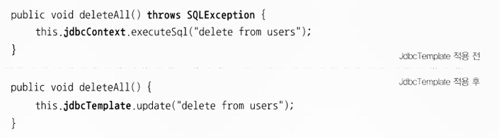

# 5주차 예외 01

## 4.1 사라진 SQLException



jdbcTemplate 적용 후 throws SQLException이 사라짐

### 4.1.1 초난감 예외처리

**예외 블랙홀**

---

예외를 잡고 아무것도 하지 않으면 안댐

문제점

- 예외로 인해 어떤 기능이 비정상적으로 동작 가능
- 메모리, 리소스 소진 가능
- 예상치 못한 다른 문제 야기 가능

예외는 적절하게 복구 or 작업 중단 or 운영자,개발자에게 통보되야 함

SQLException은 데이터 액세스 로직에 버그가 있거나 서버가 죽거나 네트워크가 끊기는 등의 심각한 상황이 벌어졌기 때문

**무의미하고 무책임한 throws**

---

throws Exception 남발

자신이 사용하려고 하는 메소드에 throws Exception가 선언되어있는 경우

문제점

- 의미 있는 정보 획득 불가
  - 어떤 예외적인 상황인지, 습관적인 예외인지 알 수 없음
- 결국 그 메소드도 throws Exceptoin을 붙이는 수밖에 없음
  - 예외 처리가 가능함에도 기회 박탈

### 4.1.2 예외 종류와 특징

**Error**

---

시스템에 뭔가 비정상적인 상황이 발생했을 경우에 사용

개발자가 해결할 수 없음 - 신경 쓰지 않아도 됨

**Exception과 체크 예외**

---

체크 예외

- RuntimeException 상속 X
- try-catch나 throws로 에러 처리 해줘야함
  - 그러지 않으면 컴파일 에러 발생

언체크 예외

- RuntimeException 상속 O


일반적인 예외 = 체크 예외

**RuntimeException과 언체크/런타임 예외**

---

따로 try-catch나 throws로 처리하지 않아도 컴파일 에러 발생 X

주로 프로그램의 오류가 있을 때 발생하도록 의도된 것

코드에서 미리 조건을 체크하도록 주의 깊게 만든다면 피할 수 있음

개발자의 부주의로 인해 발생하도록 만든 것

### 4.1.3 예외처리 방법

**예외 복구**

---

예외상황을 파악하고 문제를 해결해서 정상 상태로 돌려놓는것

try-catch에서 에러 처리

**예외처리 회피**

---

throws를 사용하여 예외 던짐

단, 의도가 분명해야함

- 긴밀한 관계에 있는 다른 오브젝트에게 예외처리 책임 지게 하거나
- 자신을 사용하는 쪽에서 예외를 다루는 게 최선의 방법이라는 분명한 확신이 있어야 함

**예외 전환**

---

발생한 예외를 그대로 넘기는 게 아니라 적절한 예외로 전환해서 던짐

목적

- 의미를 분명하게 해줄 수 있는 예외로 바꿔주기 위해
- 예외를 처리하기 쉽고 단순하게 만들기 위해 포장
  - 체크 예외를 언체크 예외로 바꾸는 경우에 사용

### 4.1.4 예외처리 전략

**런타임 예외의 보편화**

---

자바 엔터프라이스 서버환경은 수많은 사용자로 인해 예외 발생 시 작업을 일시정지하고 예외 복구를 할 수 있는 방법이 없음

예외상황을 미리 파악하고, 예외가 발생하지 않도록 차단하는 게 좋음

체크예외를 사용하면 throws Exception으로 연결된 아무런 의미없는 메소드를 낳을 뿐

**대응 불가능한 체크 예외 → 런타임 예외**

최근 API는 런타임 예외를 던지도록 설계됨

**add() 메소드의 예외처리**

---

add() 메소드는 DuplicatedUserldException과 SQLException를 던짐

위 예외는 체크 예외

SQLException 발생 원인이 ID 중복이라면 의미 있는DuplicatedUserldException을 던지고 그게 아니면 SQLException을 던짐

**SQLException은** 대부분 복구 불가능한 예외이므로 잡아봤자 처리 불가

→ **런타임 예외로 포장해 던져** 그 밖 메소드들이 신경쓰지 않게 해줌

DuplicatedUserldException도 굳이 체크 예외로 둬야 하는 것은 아님

**의미 있는 예외는** add() 메소드를 바로 호출한 오브젝트 대신 **더 앞단의 오브젝트에서 다룰 수도 있음**

→ 런타임 예외로 만들기

대신 add() 메소드는 명시적으로 DuplicatedUserldException을 던진다고 선언

- 개발자에게 의미 있는 정보를 전달을 위함

[ 아이디 중복 시 사용하는 예외 ]

```java
public class DuplicateUserldException extends RuntimeException {
	public DuplicateUserIdException(Throwable cause) {
		super(cause);
	}
}
```

[ 예외처리 전략을 적용한 add() ]

```java
public void add() throws DuplicateUserldException {
	try {
	// JDBC를 이용해 user 정보를 DB에 추가하는 코드 또는
	// 그런 기능이 있는 다른 SQLException을 던지는 메소드를 호출하는 코드
	}
	catch (SQLException e) {
		if (e.getErrorCodeO == MysqlErrorNumbers.ER_DUP_ENTRY)
			throw new DuplicateUserldException(e);
		else
			throw new RuntimeException(e);
	}
}
```

**애플리케이션 예외**

---

애플리케이션 자체의 로직에 의해 의도적으로 발생시키고, 반드시 catch 해서 무엇인가 조치를 취하도록 요구하는 예외

정상적인 흐름을 따르는 코드는 그대로 두고 예외상황에서는 비즈니스적인 의미를 띤 예외를 던지도록 만드는 것

[ 애플리케이션 예외를 사용한 코드 ]

```java
try {
	BigDecimal balance = account.withdraw(amount);
	// 정상적인 처리 결과를 출력하도록 진행
}
catch(InsufficientBalanceException e) { // 체크 예외
	// InsufficientBalanceException에 담긴 인출 가능한 잔고금액 정보를 가져옴
	BigDecimal availFunds = e.getAvailFunds();
}
```

### 4.1.5 SQLException은 어떻게 됐나?

JdbcTemplate사용시 throws SQLException 사라진 이유

SQLException 99% 복구 불가

→ 언체크/런타임 예외로 전환

JdbcTemplate는 DataAccessException으로 포장
