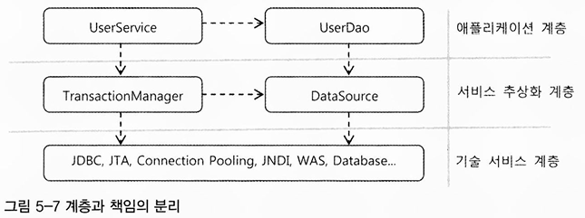

# 7주차 서비스 추상화 02

## 5.3 서비스 추상화와 단일 책임 원칙

**수직, 수평 계층구조와 의존관계**

---

UserDao와 UserService는 각각 담당하는 코드의 기능적인 관심에 따라 분리되고. 서로 불필요한 영향을 주지 않으면서 독자적으로 확장이 가능하도록 만든 것

- 수평적인 분리

트랜잭션의 추상화

- 수직적인 분리
- 애플리케이션의 비즈니스 로직과 그 하위에서 동작하는 로우레벨의 트랜잭션 기술이라는 아예 다른 계층의 특성을 갖는 코드를 분리

**단일 책임 원칙**

---

이런 적절한 분리가 가져오는 특징은 **단일 책임 원칙**으로 설명 가능

- 하나의 모듈은 한 가지 책임을 가져야 한다
- 하나의 모듈이 바뀌는 이유는 한 가지여야 함

**단일 책임 원칙의 장점**

---

어떤 변경이 필요할 때 수정 대상이 명확

좋은 코드를 설계하고 만들려면 꾸준한 노력이 필요

기능이 동작한다고 해서 코드에 쉽게 만족하지 말고 계속 다듬고 개선하려는 자세 필요

## 5.4 메일 서비스 추상화

## 5.5 정리

- 비즈니스 로직을 담은 코드는 데이터 액세스 로직을 담은 코드와 깔끔하게 분리되는 것이 바람직하다. 비즈니스 로직 코드 또한 내부적으로 책임과 역할에 따라서 깔끔하게 메소드로 정리돼야 한다.
- 이를 위해서는 DAO의 기술 변화에 서비스 계층의 코드가 영향을 받지 않도록 인터페이스와 이를 잘 활용해서 결합도를 낮춰줘야 한다.
- DAO를 사용하는 비즈니스 로직에는 단위 작업을 보장해주는 트랜잭션이 필요하다.
- 트랜잭션의 시작과 종료를 지정하는 일을 트랜잭션 경계설정이라고 한다. 트랜잭션 경계설정은 주로 비즈니스 로직 안에서 일어나는 경우가 많다.
- 시작된 트랜잭션 정보를 담은 오브젝트를 파라미터로 DAO에 전달하는 방법은 매우 비효율적이기 때문에 스프링이 제공하는 트랜잭션 동기화 기법을 활용하는 것이 편리하다.
- 자바에서 사용되는 트랜잭션 API의 종류와 방법은 다양하다. 환경과 서버에 따라서 트랜잭션 방법이 변경되면 경계설정 코드도 함께 변경돼야 한다.
- 트랜잭션 방법에 따라 비즈니스 로직을 담은 코드가 함께 변경되면 단일 책임 원칙에 위배되며, DAO가 사용하는 특정 기술에 대해 강한 결합을 만들어낸다.
- 트랜잭션 경계설정 코드가 비즈니스 로직 코드에 영향을 주지 않게 하려면 스프링이 제공하는 트랜잭션 서비스 추상화를 이용하면 된다. 서비스 추상화는 로우레벨의 트랜잭션 기술과 API의 변화에 상관없이 일관된 API를 가진 추상화 계층을 도입한다.
- 서비스 추상화는 테스트하기 어려운 JavaMail 같은 기술에도 적용할 수 있다. 테스트를 편리하게 작성하도록 도와주는 것만으로도 서비스 추상화는 가치가 있다.
- 테스트 대상이 사용하는 의존 오브젝트를 대체할 수 있도록 만든 오브젝트를 테스트 대역이라고 한다.
- 테스트 대역은 테스트 대상 오브젝트가 원활하게 동작할 수 있도록 도우면서 테스트를 위해 간접적인 정보를 제공해주기도 한다.
- 테스트 대역 중에서 테스트 대상으로부터 전달받은 정보를 검증할 수 있도록 설계된 것을 목 오브젝트라고 한다
